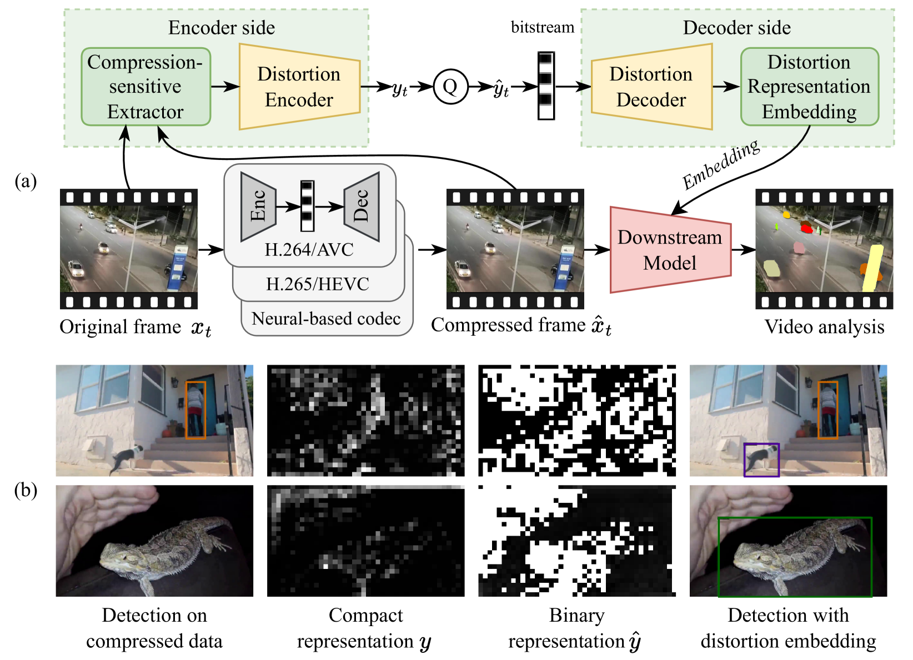

# CDRE: Compression Distortion Representation Embedding

<div align="center">

**Official Implementation · [IEEE ICME 2025]**

[](https://arxiv.org/abs/2503.21469)
[](LICENSE)
[](https://www.python.org/)
[](https://pytorch.org/)

</div>

> **Embedding Compression Distortion in Video Coding for Machines**
>
> *Yuxiao Sun, Yao Zhao, Meiqin Liu, Chao Yao, Weisi Lin*
>
> *IEEE International Conference on Multimedia and Expo (ICME), 2025*

> ⚠️ **Work in Progress**: 数据处理流程尚未上传，本项目目前不完整。Data preprocessing pipeline has not been released yet — the repository is not yet fully runnable.

## 📖 Overview

**CDRE** (Compression Distortion Representation Embedding) is a lightweight framework that enhances machine vision task performance on compressed videos. Instead of restoring pixel-domain quality, CDRE extracts, compresses, and embeds distortion representations directly into the feature backbone of downstream models — enabling them to be *aware* of specific compression artifacts during inference.

<p align="center">
  
</p>

### Key Idea

- A **Compression-Sensitive Extractor** identifies feature-domain distortions between original and compressed frames at multiple scales.
- A **Lightweight Distortion Codec** compresses the distortion information into a compact binary representation with minimal bitrate overhead.
- A **Multi-Scale Distortion Embedding Module** progressively injects distortion priors into the downstream model backbone.

### Highlights

- 🚀 **Plug-and-play**: Works with standard (H.264, H.265) and neural codecs without modifying the codec itself.
- 📉 **Minimal overhead**: Negligible increase in bitrate, latency, and parameter count.
- 🎯 **Broad applicability**: Validated on object detection, semantic segmentation, and video instance segmentation.

## 📁 Repository Structure

```
CDRE/
├── CDRE-with-Faster-R-CNN/    # Object Detection (YTVIS 2019)
├── CDRE-with-Mask2Former/     # Video Instance Segmentation (YTVIS 2019)
├── CDRE-with-keypoint-R-CNN/  # Human Keypoint Detection (COCO)
├── assets/                    # Figures and visualizations
└── README.md
```

Each sub-project is **self-contained** and includes its own `detectron2/` source with CDRE plugins.

## 🛠️ Installation

### Requirements

- Python 3.8+
- PyTorch ≥ 1.10 with CUDA
- GCC ≥ 5

### Setup

```bash
# Clone the repository
git clone https://github.com/Ws-Syx/CDRE.git
cd CDRE

# Install detectron2 for each task (example: Mask2Former)
cd CDRE-with-Mask2Former/detectron2
pip install -e .
cd ../..

# Install additional dependencies
pip install -r requirements.txt
```

## 🚀 Quick Start

### Step 1: Prepare Data

Our experiments use the **YTVIS 2019** dataset with compression pairs (original + compressed frames). Please refer to the [YT-VIS website](https://youtube-vos.org/dataset/vis/) to download the dataset.

The dataset is registered as pairs: each sample consists of an original frame and its compressed counterpart. See `datasets/` in each sub-project for registration details.

### Step 2: Download Pretrained Weights

Pretrained backbone weights can be downloaded from the [detectron2 Model Zoo](https://github.com/facebookresearch/detectron2/blob/main/MODEL_ZOO.md). Place them under `ckpt/` in the corresponding task directory.

Our CDRE model weights are available at:
- [Release Page](https://github.com/Ws-Syx/CDRE/releases) *(coming soon)*

### Step 3: Training

```bash
# Faster R-CNN — Object Detection
cd CDRE-with-Faster-R-CNN
bash train.sh
```

```bash
# Mask2Former — Video Instance Segmentation
cd CDRE-with-Mask2Former
bash train.sh
```

```bash
# Keypoint R-CNN — Human Keypoint Detection
cd CDRE-with-keypoint-R-CNN
bash train.sh
```

### Step 4: Evaluation

```bash
# Example: evaluate Faster R-CNN
cd CDRE-with-Faster-R-CNN
bash test.sh
```

## 🧪 Supported Tasks & Codecs

| Task | Model | Backbone | Dataset |
|------|-------|----------|---------|
| Object Detection | Faster R-CNN | ResNet-50 FPN | YTVIS 2019 |
| Video Instance Segmentation | Mask2Former | Swin-T / ResNet-50 | YTVIS 2019 |
| Human Keypoint Detection | Keypoint R-CNN | ResNet-50 FPN | COCO Keypoints |

**Tested codecs:**
- H.264 (QP 26/29/32/35)
- H.265 (QP 26/29/32/35)
- DCVC-DC (PSNR levels 0-3)
- DCVC (PSNR levels 0-3)
- JPEG2000, Cheng2020 (keypoint task)

## 📊 Results


> Full quantitative results are reported in the [paper](https://arxiv.org/abs/2503.21469).

## 🏗️ CDRE Plugins

The CDRE framework is implemented as **detectron2 plugins** located inside each sub-project's `detectron2/` directory:

| Module | Location | Description |
|--------|----------|-------------|
| `DistortionExtractor` | `modeling/backbone/distortion_extractor.py` | Multi-scale compression-sensitive feature extractor |
| `DistortionCodec` | `modeling/backbone/distortion_codec.py` | VAE-based distortion representation compression |
| `DistortionEmbedding` | `modeling/backbone/distortion_embedding.py` | Multi-scale embedding into downstream backbone |
| `GeneralizedRCNN_v2` | `modeling/meta_arch/rcnn_v2.py` | Extended meta-architecture with CDRE hooks |
| `ResNetFPNBackbone_v2` | `modeling/backbone/fpn_v2.py` | Extended FPN backbone for CDRE |

## 📝 Citation

If you find this work useful, please cite:

```bibtex
@inproceedings{sun2025cdre,
  title     = {Embedding Compression Distortion in Video Coding for Machines},
  author    = {Sun, Yuxiao and Zhao, Yao and Liu, Meiqin and Yao, Chao and Lin, Weisi},
  booktitle = {IEEE International Conference on Multimedia and Expo (ICME)},
  year      = {2025}
}
```

## 📜 License

This project is released under the [MIT License](LICENSE).

## 🙏 Acknowledgements

We thank the [detectron2](https://github.com/facebookresearch/detectron2) and [Mask2Former](https://github.com/facebookresearch/Mask2Former) teams for their excellent codebases.
